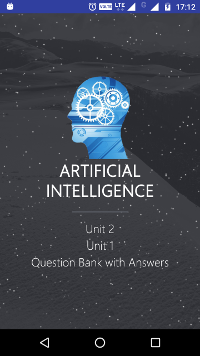
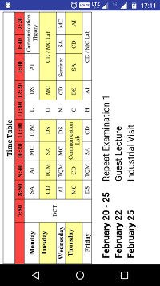
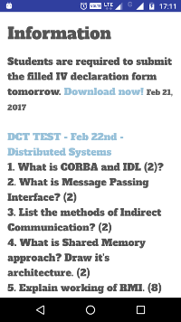

# SMILE - Mobile App
##  Simple Mobile Instant Learning Environment
An online portal that provides academic updates and information. For the students, by the students.

### Home Screen
Contains the buttons to the various modules available. Navigation bar includes the shortcuts along with the exclusive Contact Us option.
  &nbsp;&nbsp;&nbsp;&nbsp;&nbsp;&nbsp;&nbsp;&nbsp;&nbsp;&nbsp;&nbsp;&nbsp;&nbsp;&nbsp;&nbsp;&nbsp;&nbsp;&nbsp; 
 
### Subjects
Contains the various subjects along with notes. 
 &nbsp;&nbsp;&nbsp;&nbsp;&nbsp;&nbsp;&nbsp;&nbsp;&nbsp;&nbsp;&nbsp;&nbsp;&nbsp;&nbsp;&nbsp;&nbsp;&nbsp;&nbsp;  
### Time table
Contains the regular class time table along with the schedule of other events. 

### Placement
Contains a few questions and answers for Placement Training. 
 &nbsp;&nbsp;&nbsp;&nbsp;&nbsp;&nbsp;&nbsp;&nbsp;&nbsp;&nbsp;&nbsp;&nbsp;&nbsp;&nbsp;&nbsp;&nbsp;&nbsp;&nbsp; 
### Information
Contains updates for students along with daily DCT questions, exam time table etc. 

## Technical specifications
- Built on the Android Studio IDE with Java as a backend.
- The App requires an Internet Connection to display the latest updates but previous updates can be viewed offline also. (First execution requires Internet)
- Minimum Requirement Android 4.4 Lollipop
- App is designed targeting devices with screen size of 5" and more.
- Further versions would support smaller screen sizes also.
